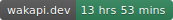

# slash_dot

This project is an internship task for SlashDot. The task is to recreate 2 screens of SlashDot app using Flutter.

The first screen shows the list of all products. The second screen shows the details of a product.

## Architecture

* BLoC + rxdart for state management
* riverpod for dependency injection
* dio for network requests and REST API
* freezed for data classes
* bloc_test for unit testing BLoCs
* mockito for mocking dependencies

## Continuous Deployment

The project uses GitHub Actions for continuous deployment

The workflow runs tests then builds the app for Android if all tests succeed, and finally uploads the APK to GitHub releases

You can download the APK from the [latest release](https://github.com/Andrew-Bekhiet/slash_dot/releases/latest)

## Screenshots and Video

https://github.com/Andrew-Bekhiet/slash_dot/assets/40571928/3f63651e-f8ca-4ba5-a7cb-e2e1062960f8

