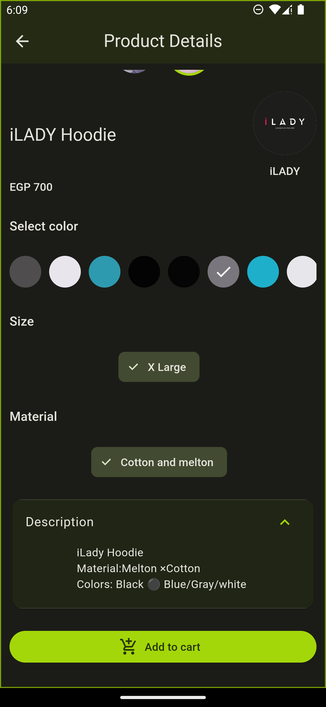

# slash_dot

This project is an internship task for SlashDot. The task is to recreate 2 screens of SlashDot app using Flutter.

The first screen shows the list of all products. The second screen shows the details of a product.

## Architecture

The project uses BLoC pattern with rxdart for state management, riverpod for dependency injection and freezed for data classes

## Continuous Deployment

The project uses GitHub Actions for continuous deployment

The workflow runs tests and builds the app for Android then uploads the APK to GitHub releases

You can download the APK from the latest release [here](https://github.com/Andrew-Bekhiet/slash_dot/releases/latest)

## Screenshots and Video

### [Video Link](screenshots/video.mp4)

